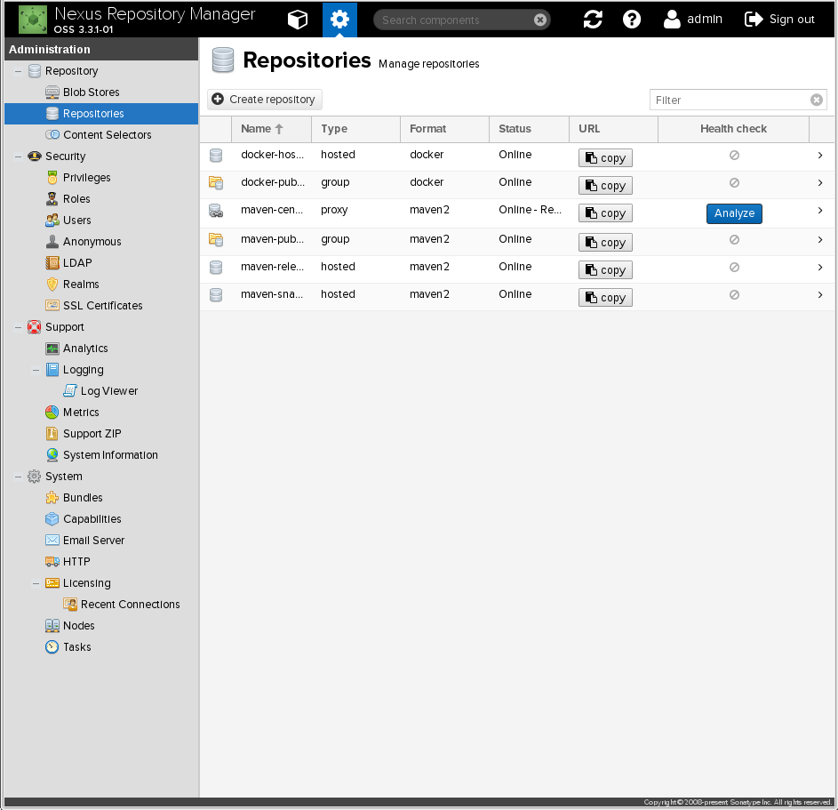
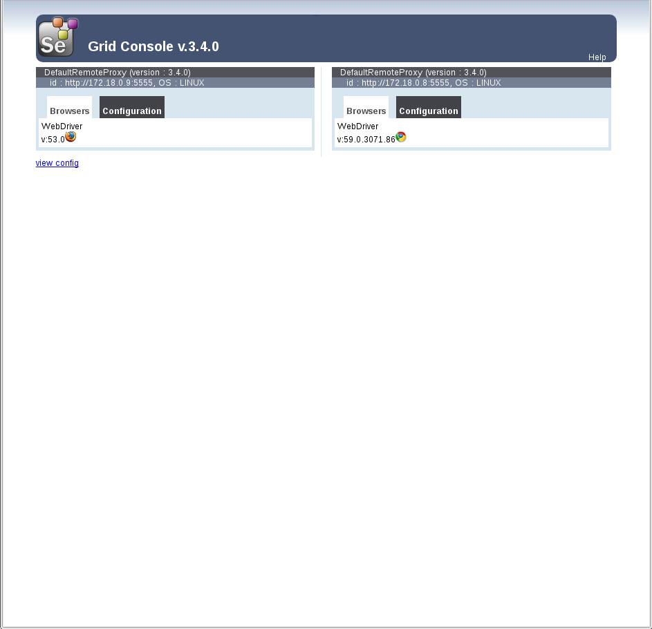

# CI Tools Demo

This GitHub repository contains Dockerfiles for running a set of Continuous Integration Tools with a single command. The diagram contains all tools used in the Docker containers.


Original blog article on the CI Docker Container, https://blog.codecentric.de/en/2015/10/continuous-integration-platform-using-docker-container-jenkins-sonarqube-nexus-gitlab


## With Docker Linux Native

If you want to use new Docker Mac Native implementation without VirtualBox and Docker Toolbox, follow these steps:

### Step 0 - Install Docker Linux Native

[Install Docker Linux Native](https://docs.docker.com/engine/installation "Install Docker") and afterwards follow the steps described in https://docs.docker.com/compose/install for Docker Compose.

If everything went fine, docker --version should give something like this (or a higher version number):
```
$ docker --version
Docker version 17.06.0-ce, build 02c1d87

$ docker-compose --version
docker-compose version 1.14.0, build c7bdf9e
```

### Step 1 - Clone Repository

```
# Clone Repository
# Option A: clone via https
git clone https://github.com/selste/docker-ci-tool-stack.git

# Option B: if you have your ssh keys configured for your GitHub account
git clone git@github.com:selste/docker-ci-tool-stack.git

cd docker-ci-tool-stack
```

### Step 2 - Build and start containers

```
# Startup containers
# Option A: via the provided shell script
./setup.sh

# Option B: setting an environment variable and running docker-compose up
unset DOCKER_GROUP_ID
export DOCKER_GROUP_ID=`getent group docker | cut -d: -f3`
docker-compose up -d
```
This is necessary because Jenkins needs to have access to the Docker daemon running on the host. Since the id for the 'docker' group is dependent on the distribution (and the method of installation) used, it is dynamically provided as a variable during image creation.

In order to use Selenium for automated GUI tests, execute
```
docker-compose -f docker-compose-selenium.yml up -d
```
as well.

### Step 3 - Postinstallation

#### GitLab

1. A password for the *root* account hs to be set after first startup.
2. Jenkins is configured to create a Pipeline job on startup for a project hosted in GitLab. Once the password to access GitLab has been created login and create a new project by cloning the demo project hosted on [GitHub](https://github.com/oraum/jee-7-demo-app "jee-7-demo-app"). Make sure the name of the project is *jee-7-demo-app* and that it is *public*.

## Access Tools

| *Tool* | *Link* | *Credentials* |
| ------------- | ------------- | ------------- |
| Jenkins | http://localhost:18080/ | no login required |
| SonarQube | http://localhost:19000/ | admin/admin |
| Nexus | http://localhost:18081 | admin/admin123 |
| GitLab | http://localhost | root password to be created on first startup |
| Selenium Grid | http://localhost:4444/grid/console | no login required |

## Screenshots

Here is an overview of all tools:

- GitLab is used for storing the Source Code
- Jenkins contains build job and is triggered once projects in GitLab are updated
- As part of the CI build, Jenkins triggers a static code analysis and the results are stored in SonarQube
- The Maven build uses Nexus as a Proxy Repository for all 3rd party libs. The build artifacts are deployed to the Nexus Release Repository
- The Selenium Grid contains Docker containers running Chrome and Firefox and is used for UI tests

### Jenkins Jobs

There are several jobs preconfigured in Jenkins.
The Jobs cover the following tasks:

- Continuous Integration Build with Maven
- Unit Tests
- Static Source Analysis results are stored in SonarQube
- JaCoCo Test Coverage
- Deployment to Nexus
- Jenkins Job DSL examples
- Selenium UI Test


### SonarQube Dashboard


### Nexus Repository



### Selenium Grid



## Testing Upgrades

In order to test new versions, I prefer starting out with a blank VirtualBox image.
That eliminates any side effects. Afterwards you can throw away the image.

```
# Create new image
docker-machine create --driver virtualbox --virtualbox-memory 6000 docker-ci-v1

# Configure shell environment
eval $(docker-machine env docker-ci-v1)
```
